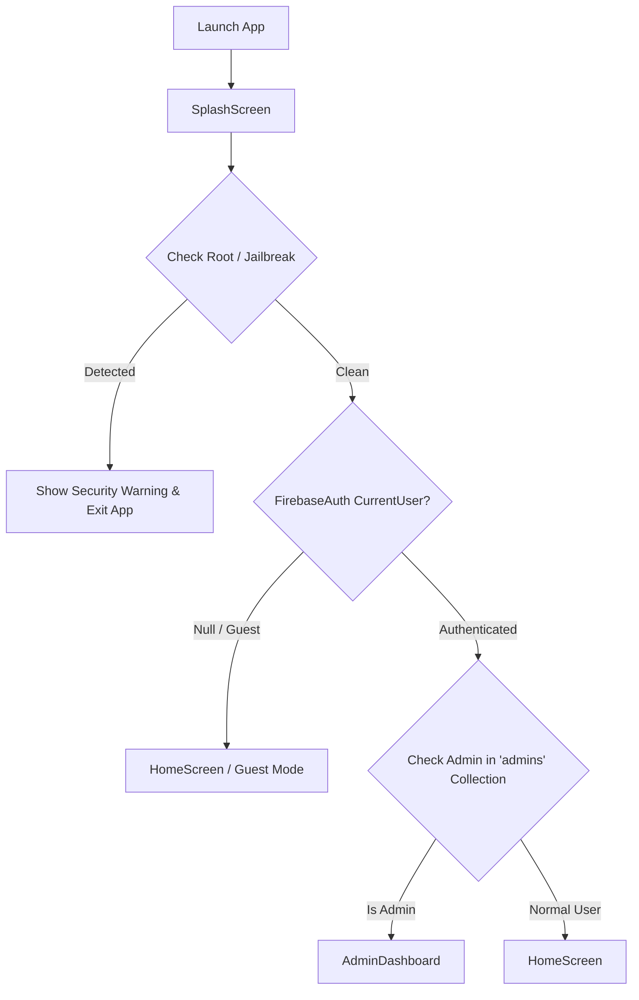
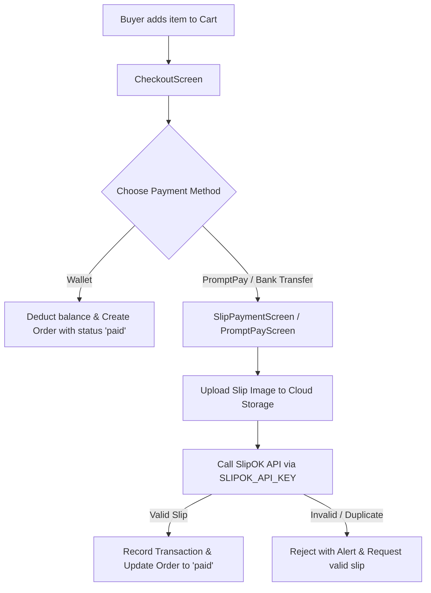

# AGENTS.md - Saidee App AI Agent Operations Guide

คู่มือมาตรฐานและข้อกำหนดสำหรับ AI Coding Agents ที่เข้ามาทำงานในโปรเจกต์ **Saidee App** เพื่อรักษาคุณภาพโค้ด ความปลอดภัย และสถาปัตยกรรมของระบบให้เป็นไปในทิศทางเดียวกันอย่างเคร่งครัด

---

## 1. Project Overview & Architecture

### 1.1 วัตถุประสงค์ของโปรเจกต์ (Project Mission)
**Saidee (สายดี)** เป็นแอปพลิเคชันมือถือ (ปัจจุบันเน้นภาษาไทยเป็นหลัก) สำหรับการช่วยเหลือทางสังคมและคอมมูนิตี้มาร์เก็ตเพลส (Community E-Commerce & Mutual Aid Platform) โดยมีฟีเจอร์หลักในการซื้อขายสินค้า, การจัดส่ง, ระบบกระเป๋าเงิน (Wallet) พร้อมการตรวจสอบสลิปโอนเงิน, ระบบแชทระหว่างผู้ซื้อและผู้ขาย, ระบบคะแนน/คูปอง และระบบบริหารจัดการสำหรับผู้ดูแลระบบ (Admin Dashboard)

### 1.2 Tech Stack หลัก
- **Framework**: Flutter (Dart SDK `^3.8.1`, Flutter 3.x+ Stable Channel)
- **State Management & Routing**:
  - **Provider** (`provider: ^6.1.5+1`): จัดการ State ส่วนกลางระดับแอป (เช่น `ThemeProvider`)
  - **GetX** (`get: ^4.7.3`): จัดการ Navigation (`Get.to`, `Get.offAll`, `Get.back`), Snackbars (`Get.snackbar`) และ Overlays
  - **StatefulWidget / setState**: จัดการ Local Widget State
- **Backend & Cloud Infrastructure**:
  - **Firebase Auth**: ระบบยืนยันตัวตน (Email/Password, Role-based user records)
  - **Cloud Firestore**: ฐานข้อมูล NoSQL แบบเรียลไทม์
  - **Firebase Cloud Storage**: จัดเก็บรูปภาพสินค้า, สลิปโอนเงิน, รูปโปรไฟล์ และวิดีโอ
  - **Firebase Cloud Messaging (FCM)** + **flutter_local_notifications**: Push Notification (Foreground & Background)
  - **Cloud Functions**: แบ็กเอนด์ประมวลผล Webhook / Tasks
- **External Services & Integrations**:
  - **SlipOK API**: ตรวจสอบความถูกต้องของสลิปโอนเงินธนาคารแบบอัตโนมัติ
  - **Xendit / PromptPay**: ช่องทางการชำระเงิน
  - **Google Maps & Geolocator**: บริการแผนที่และพิกัดตำแหน่งที่อยู่
  - **flutter_dotenv**: โหลด Environment Variables จากไฟล์ `.env`
- **Security & Integrity Packages**:
  - `flutter_jailbreak_detection`: ตรวจสอบการ Root / Jailbreak
  - `flutter_windowmanager_plus` & `secure_application`: ป้องกันการจับภาพหน้าจอ (`FLAG_SECURE`)
  - `flutter_secure_storage`: จัดเก็บข้อมูลความปลอดภัยใน Secure Enclave / KeyStore

### 1.3 Architecture Pattern
โปรเจกต์ใช้โครงสร้างแบบ **Modular Layered Architecture (Service-Centric Pattern)**:
- **Presentation Layer (`lib/screens`, `lib/widgets`)**: หน้าจอ UI แยกตามโมดูลฟีเจอร์ โดยใช้ Reusable Widgets ร่วมกัน
- **Service Layer (`lib/services`)**: Business Logic, Helper Data, External API Clients และ Security Controls
- **Data/Model Layer (`lib/models`)**: Data Models แปลงจาก Firestore Documents (`fromMap`, `toMap`)
- **Configuration Layer (`lib/config`)**: Collection Names รวมศูนย์ (`FirestoreCollections`) และ Style Tokens (`AppTheme`)

---

## 2. Directory Structure

แผนผังไดเรกทอรีสำคัญในโปรเจกต์:

```
saidee_app/
├── .agents/                      # Custom Agent Rules & Contexts
│   └── AGENTS.md                 # Original Agent Rules (e.g. Git commit specs)
├── android/                      # Android Native Configuration & Build Setup
├── assets/
│   ├── documents/                # Legal, Privacy, Policy markdown docs
│   └── images/                   # App logos, banners, placeholders
├── ios/                          # iOS Native Project Configuration
├── lib/
│   ├── config/                   # Constants และ Configuration ส่วนกลาง
│   │   ├── firestore_collections.dart  # [CRITICAL] รวมชื่อ Collection ของ Firestore ทั้งหมด
│   │   └── theme.dart            # App Theme (Colors, Light/Dark theme, Typography)
│   ├── models/                   # Data Transfer Objects & Domain Models
│   │   ├── cart_item_model.dart  # โมเดลสินค้าในตะกร้า
│   │   ├── coupon_model.dart     # โมเดลคูปองส่วนลด
│   │   ├── order_model.dart      # โมเดลคำสั่งซื้อ
│   │   ├── product_model.dart    # โมเดลสินค้า
│   │   ├── transaction_model.dart# โมเดลธุรกรรมทางการเงิน
│   │   └── user_model.dart       # โมเดลข้อมูลผู้ใช้
│   ├── providers/                # App-wide State Providers (Provider Pattern)
│   │   └── theme_provider.dart   # จัดการ Light/Dark Mode Toggle
│   ├── screens/                  # หน้าจอแอปพลิเคชัน แยกตามหมวดหมู่
│   │   ├── admin/                # แดชบอร์ดและหน้าจอจัดการของผู้ดูแลระบบ (Admin Only)
│   │   ├── auth/                 # หน้าจอ Login, Register, Password Recovery
│   │   ├── cart/                 # หน้าจอตะกร้าสินค้า
│   │   ├── chat/                 # แชทแบบเรียลไทม์ระหว่างผู้ซื้อและผู้ขาย
│   │   ├── checkout/             # คำนวณยอดเงินและชำระเงิน (PromptPay / Slip / Wallet)
│   │   ├── home/                 # หน้าหลัก ฟีดสินค้า แนะนำ หมวดหมู่ และค้นหา
│   │   ├── notification/         # หน้ารวมประวัติการแจ้งเตือน
│   │   ├── order/                # หน้าจัดการคำสั่งซื้อฝั่งผู้ซื้อ (Buyer) และผู้ขาย (Seller)
│   │   ├── product/              # หน้ารายละเอียดสินค้าและหน้าลงขายสินค้าใหม่
│   │   ├── profile/              # โปรไฟล์ผู้ใช้ จัดการที่อยู่ ประวัติล็อกอิน และความปลอดภัย
│   │   ├── store/                # หน้าร้านค้าของผู้ขายและการตั้งค่าจัดส่ง
│   │   ├── wallet/               # หน้ากระเป๋าเงิน เติมเงิน ถอนเงิน แนบสลิป และประวัติธุรกรรม
│   │   ├── opening_screen.dart   # หน้าแนะนำแอปเบื้องต้นสำหรับผู้ใช้ใหม่ (Onboarding)
│   │   └── splash_screen.dart    # หน้าเริ่มต้นแอป ตรวจสอบ Root/Jailbreak และ Routing
│   ├── services/                 # Services & Utilities
│   │   ├── announcement_data_helper.dart # จัดการประกาศของระบบ
│   │   ├── coupon_data_helper.dart       # จัดการคูปองส่วนลด
│   │   ├── guided_tour_service.dart      # Interactive Coach Mark Tour
│   │   ├── notification_service.dart     # FCM + Local Notification Handler
│   │   ├── recommendation_service.dart   # ระบบแนะนำสินค้าตามความสนใจ
│   │   ├── role_guard_service.dart       # การ์ดตรวจสอบสิทธิ์ผู้ดูแลระบบ (Admin Guard)
│   │   ├── security_service.dart         # XSS Sanitization, Regex Validators
│   │   └── shipping_data_helper.dart     # คำนวณค่าส่งและตัวเลือกการจัดส่ง
│   ├── widgets/                  # Reusable UI Components
│   │   ├── app_exit_scope.dart   # ดักจับการกด Back สองครั้งเพื่อป้องกันการเผลอปิดแอป
│   │   ├── common_widgets.dart   # Buttons, Shimmer Loaders, Empty States ทั่วไป
│   │   ├── custom_dialog.dart    # AppDialog มาตรฐานสำหรับแสดง Alert/Confirmation
│   │   └── guest_view.dart       # UI กันผู้ใช้ Guest ไม่ให้เข้าถึงฟีเจอร์ที่ต้องล็อกอิน
│   ├── firebase_options.dart     # การตั้งค่า Firebase Generated โดย FlutterFire CLI
│   └── main.dart                 # App Entry Point, Init Services, FCM Routing, Theme Wrapper
├── test/                         # Unit Tests & Widget Tests
├── .env.example                  # Template สำหรับ Environment Variables
├── firestore.rules               # กฎความปลอดภัย Firestore Rules
├── pubspec.yaml                  # รายการ Dependencies และ Asset Declarations
└── security_guidelines.md        # แนวทางปฏิบัติด้านความปลอดภัยและการ Build Obfuscate
```

---

## 3. Setup & Execution Commands

### 3.1 การเตรียมสภาพแวดล้อม (Environment Setup)
1. ติดตั้ง Dependencies:
   ```bash
   flutter pub get
   ```
2. สร้างไฟล์ `.env` จาก Template:
   ```bash
   cp .env.example .env
   ```
   *ตรวจสอบว่ามีการตั้งค่าคีย์ที่จำเป็น เช่น `SLIPOK_API_KEY`, `GOOGLE_MAPS_API_KEY`, `PROJECT_ID` ครบถ้วน*

### 3.2 การรันแอปพลิเคชัน (Local Development)
- รันบน Device / Emulator ที่เชื่อมต่อ:
  ```bash
  flutter run
  ```
- รันแบบระบุ Target Device:
  ```bash
  flutter devices
  flutter run -d <device-id>
  ```

### 3.3 Static Analysis & Code Testing
- รัน Static Analysis เพื่อตรวจสอบ Linter และ Syntax Errors:
  ```bash
  flutter analyze
  ```
- รัน Unit / Widget Tests ทั้งหมด:
  ```bash
  flutter test
  ```

### 3.4 การสร้าง Build สำหรับ Production (Secure Obfuscation)
> **สำคัญมาก**: ตามข้อกำหนดใน `security_guidelines.md` การ Build สำหรับ Production **ต้องทำ Code Obfuscation เสมอ** เพื่อป้องกันการ Reverse-Engineering

- **Android App Bundle (AAB)**:
  ```bash
  flutter build appbundle --obfuscate --split-debug-info=build/app/outputs/symbols
  ```
- **Android APK**:
  ```bash
  flutter build apk --obfuscate --split-debug-info=build/app/outputs/symbols
  ```
- **iOS IPA**:
  ```bash
  flutter build ipa --obfuscate --split-debug-info=build/app/outputs/symbols
  ```

---

## 4. Agent Working Rules & Conventions

### 4.1 Coding Standards
1. **ภาษาใน User Interface**: แอปนี้รองรับ **ภาษาไทยเท่านั้น (Thai only)** ข้อความ UI, Dialogs, Toasts, Validation Messages ทั้งหมดต้องเป็นภาษาไทยที่สุภาพ กระชับ และสื่อความหมายถูกต้อง
2. **Collection Names**: **ห้าม Hardcode สตริงชื่อ Collection ใน Firestore เด็ดขาด** ให้ใช้ `FirestoreCollections.<name>` จาก [firestore_collections.dart](file:///c:/Coding/flutter/mobile-app/saidee_app/saidee_app/lib/config/firestore_collections.dart) เสมอ
3. **Theme & Styling**:
   - ใช้ค่าสีจาก `AppTheme` ใน [theme.dart](file:///c:/Coding/flutter/mobile-app/saidee_app/saidee_app/lib/config/theme.dart) (เช่น `AppTheme.primaryColor`, `AppTheme.surfaceColor`) ห้ามสุ่มค่าสีนอก Theme
   - ใช้แบบอักษรผ่าน `GoogleFonts` ตามที่เซ็ตไว้ในโปรเจกต์
4. **Dialogs & Alerts**:
   - ใช้ `AppDialog.showCustomDialog(...)` จาก [custom_dialog.dart](file:///c:/Coding/flutter/mobile-app/saidee_app/saidee_app/lib/widgets/custom_dialog.dart) แทนการเขียน `showDialog()` ขึ้นมาใหม่แบบกระจัดกระจาย เพื่อรักษาความสม่ำเสมอของ UI
5. **Memory Management**:
   - หน้าจอที่มี `StreamSubscription`, `TextEditingController`, `AnimationController`, หรือ `ScrollController` **ต้องทำการ cancel/dispose ใน `dispose()` เสมอ**
6. **Double Back to Exit**:
   - หน้าจอหลัก เช่น `HomeScreen` ต้องห่อหุ้มด้วย `AppExitScope` เพื่อป้องกันไม่ให้ผู้ใช้เผลอกด Back ออกจากแอปโดยไม่ตั้งใจ

### 4.2 Security Rules (Do's & Don'ts)
- ❌ **ห้าม Commit API Keys หรือ Secrets**: ห้ามฮาร์ดโค้ดคีย์ในซอร์สโค้ด ให้เรียกผ่าน `dotenv.env['KEY_NAME']` เสมอ
- ⚠️ **การเรียกใช้ dotenv**: ต้องตรวจสอบ `dotenv.isInitialized` ก่อนเข้าถึงค่าเสมอ เช่น:
  ```dart
  final apiKey = dotenv.isInitialized ? (dotenv.env['SLIPOK_API_KEY'] ?? '') : '';
  ```
- 🛡️ **การปกป้องหน้าจอความลับ (FLAG_SECURE)**:
  - หน้าจอที่เกี่ยวข้องกับเงิน, สลิป, และข้อมูลส่วนบุคคล (เช่น `WalletTopUpScreen`, `WalletWithdrawScreen`, `ProfileScreen`) ต้องเปิด `FlutterWindowManagerPlus.FLAG_SECURE` ใน `initState` และล้างค่าออกใน `dispose` เสมอ
- 🛡️ **Admin Role Enforcement**:
  - หน้าจอฝั่ง `screens/admin/` ทั้งหมด ต้องผ่านการตรวจสอบสิทธิ์ด้วย `RoleGuardService.checkAdminAccess(context)` ก่อนแสดงผลเสมอ
- 🧹 **Input Sanitization**:
  - ข้อความที่ผู้ใช้กรอกก่อนบันทึกหรือแสดงผล ต้องผ่าน `SecurityService.sanitizeText()` เพื่อป้องกัน XSS และ Injection Attacks

### 4.3 Git Commit Convention (บังคับใช้อย่างเคร่งครัด)
อ้างอิงตามข้อกำหนดใน `.agents/AGENTS.md` ให้ใช้รูปแบบ Conventional Commits:
- **Format**: `<type>(<scope>): <short description in present tense>`
- **Title Length**: ไม่เกิน **50 ตัวอักษร**
- **Types**: `feat`, `fix`, `refactor`, `perf`, `docs`, `style`, `test`, `chore`
- **Body**: หากจำเป็น ให้ระบุเหตุผล "Why" ของการเปลี่ยนแปลง ไม่ใช่แค่ "What"

---

## 5. Key Modules & Workflows

### 5.1 Authentication & Boot Flow


### 5.2 Checkout & Payment Verification Workflow


### 5.3 Notification & FCM Handling
- **Background Messages**: ประมวลผลผ่าน `_firebaseMessagingBackgroundHandler` ใน [main.dart](file:///c:/Coding/flutter/mobile-app/saidee_app/saidee_app/lib/main.dart)
- **Foreground Messages**: ใช้ `FlutterLocalNotificationsPlugin` ร่วมกับ `Get.snackbar` โดยมีการกรองข้อความซ้ำซ้อนผ่าน `NotificationService.isDuplicateNotification(title, body)`
- **Payload Routing**: นำทางผู้ใช้ไปยังหน้าจอเป้าหมายตามประเภทของแจ้งเตือน (`chat` -> `ChatScreen`, `new_order` / `order_status` -> `BuyerOrderDetailScreen` หรือ `SellerOrderDetailScreen`, `wallet` -> `WalletHistoryScreen`)

---

## 6. Testing & Verification Checklist for Agents

ก่อนที่ AI Agent จะสรุปงานหรือส่งมอบการแก้ไขโค้ด **ต้องทำการตรวจสอบตาม Checklist ต่อไปนี้ทุกครั้ง**:

1. [ ] **Static Code Analysis**: รัน `flutter analyze` ต้องไม่พบ Syntax Errors หรือ Critical Warnings ใหม่
2. [ ] **No Secrets in Code**: ตรวจสอบว่าไม่มีการทิ้ง API Keys, Password, หรือ PII ไว้ในโค้ดหรือ Log (`print`)
3. [ ] **Environment Fallback**: โค้ดที่เรียกใช้ `.env` มีการตรวจสอบ `dotenv.isInitialized` และมี fallback ป้องกัน Crash
4. [ ] **Resource Cleanup**: ทุก Controller, Stream และ Listener มีการเรียก `dispose()` หรือ `cancel()` อย่างถูกต้อง
5. [ ] **Thai Language UI**: สตริง UI และ Alert Messages ทั้งหมดเป็นภาษาไทยและไม่มีคำที่ตกหล่น
6. [ ] **Null Safety & Type Safety**: ไม่มีการใช้ `!` บังคับ Unwrapping ค่า Nullable โดยไม่มีการ Guard ล่วงหน้า
7. [ ] **Git Commit Message**: ตรวจสอบความถูกต้องของ Commit Message ให้ตรงตามกฎ Conventional Commits (ความยาวไม่เกิน 50 ตัวอักษร)
